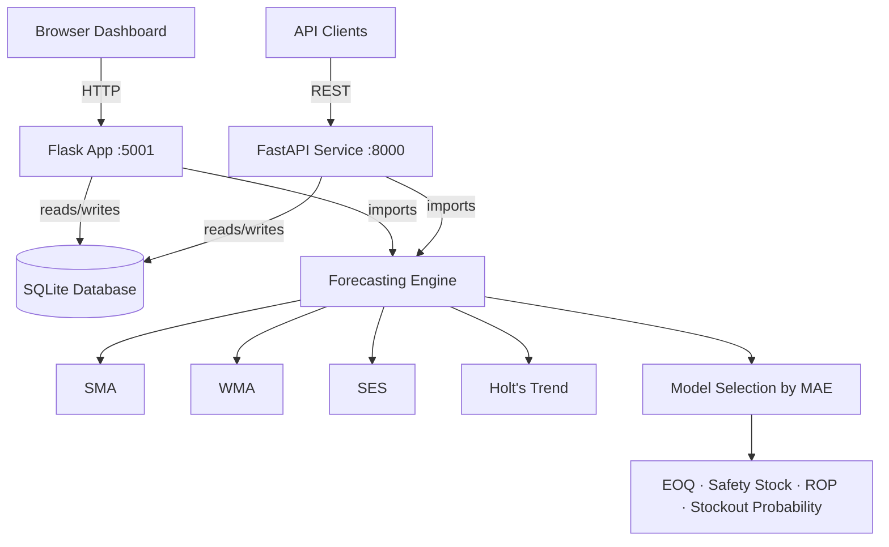

# StockLens

**Intelligent Inventory Decision Support for Retail SMEs**

[](https://github.com/YOUR_GITHUB_USERNAME/stocklens/actions/workflows/ci.yml)

> Final-year dissertation project — BSc Data Science & Technology, 
> Northumbria University London (Predicted First-Class Honours)

StockLens eliminates intuition-based inventory decisions for retail SMEs 
through automated multi-model demand forecasting, explainable replenishment 
recommendations, and a production-grade REST API.

---

## Live Demo

| Service | URL |
|---|---|
| Dashboard | [stocklens.onrender.com](https://stocklens.onrender.com) |
| Forecasting API | [stocklens-api.onrender.com/docs](https://stocklens-api.onrender.com/docs) |

**Demo credentials:** email `manager1@stocklens.local` / password `pass123`

---

## Architecture



---

## Forecasting Performance

Evaluated across five metrics on held-out validation windows.

| Dataset Pattern | Best Model | MAE | vs SMA Baseline |
|---|---|---|---|
| Mild upward trend | Holt's Trend | 7.1 | −52% |
| Stable demand | SES | 4.3 | −18% |
| High variability | WMA | 9.8 | −11% |
| Flat / inactive | SMA | 2.1 | baseline |

Automated model selection chooses the best model per SKU at runtime 
using train/validate MAE scoring. No manual configuration required.

---

## System Capabilities

**Forecasting engine**
- Four models evaluated per product: SMA, WMA, SES, Holt's Trend
- Automated model selection via validation MAE scoring
- 95% confidence intervals on all forecasts
- Trend detection via OLS linear regression (INCREASING / STABLE / DECREASING)
- Stockout probability calculated from Normal distribution during lead time

**Inventory intelligence**
- Safety stock: Z × σ × √(lead time) at 95% service level
- Reorder point: (daily demand × lead time) + safety stock
- Economic Order Quantity: Wilson formula (√(2DS/H))
- ABC-XYZ product classification by revenue contribution and demand variability

**Decision engine**
- Explainable recommendations: REORDER, AT_RISK, HOLD, INACTIVE
- Human-readable reasoning attached to every decision
- Scenario comparison: system decisions vs naive baseline

**Production features**
- Multi-tenant architecture with company isolation at database level
- CSRF protection, session security, email verification, password reset
- CSV/XLSX upload pipeline with header mapping and duplicate detection
- Async pipeline jobs with status polling
- Role-based access control (manager / staff)

---

## REST API

The FastAPI service exposes the forecasting engine as a typed REST API 
with automatic OpenAPI documentation.

```
GET  /health                          Service health check
POST /forecast/{product_id}           Run forecast for a product
GET  /forecast/{product_id}/latest    Get latest forecast result
GET  /decisions/{company_id}          Get current decisions for a company
```

Interactive docs: `/docs` (Swagger UI) · `/redoc` (ReDoc)

---

## Tech Stack

| Layer | Technology |
|---|---|
| Web framework | Flask 3.1 |
| REST API | FastAPI 0.115 + Uvicorn |
| Data layer | SQLite + raw SQL (sqlite3) |
| Forecasting | Pure Python (no sklearn dependency) |
| Frontend | HTML/CSS/JavaScript + Chart.js |
| Containerisation | Docker + Docker Compose |
| CI/CD | GitHub Actions |
| Deployment | Render |
| Testing | pytest + httpx |
| Linting | ruff |

---

## Local Setup

**Prerequisites:** Python 3.12, Git

```bash
# 1. Clone and enter
git clone https://github.com/YOUR_GITHUB_USERNAME/stocklens.git
cd stocklens

# 2. Create virtual environment
python -m venv venv
source venv/bin/activate  # Windows: venv\Scripts\activate

# 3. Install dependencies
pip install -r requirements.txt -r requirements-api.txt

# 4. Seed the database
python setup/create_db.py
python setup/generate_data.py
python setup/run_forecasts.py

# 5. Copy environment file
cp .env.example .env
```

**Run Flask dashboard:**
```bash
python run.py
# Open http://localhost:5001
```

**Run FastAPI service:**
```bash
uvicorn api_service.main:app --reload --port 8000
# Open http://localhost:8000/docs
```

**Run tests:**
```bash
pytest tests/ -v
```

---

## Docker

```bash
# Build and start both services
docker compose up --build

# Flask dashboard: http://localhost:5001
# FastAPI docs:    http://localhost:8000/docs
```

---

## Research Methodology

StockLens was developed using Design Science Research (DSR) methodology 
integrated with Agile development cycles and the CRISP-DM data science 
process. The system was evaluated against five forecasting accuracy metrics:

- **MAE** — Mean Absolute Error (primary model selection criterion)
- **RMSE** — Root Mean Square Error (penalises large errors)
- **MASE** — Mean Absolute Scaled Error (scale-independent comparison)
- **Bias** — Systematic over/under-forecasting detection
- **Tracking Signal** — Cumulative forecast error monitoring

---

## Key Technical Decisions

**Why raw SQL over SQLAlchemy ORM?**
Full control over query structure, no N+1 query risk, and the schema 
evolution requirements of a dissertation build were better served by 
explicit migration functions than ORM-managed migrations.

**Why four forecasting models instead of ARIMA or ML methods?**
SMEs typically have 30–90 days of sales history. ARIMA requires 
stationarity testing and sufficient data for reliable parameter estimation. 
The four selected methods are robust to limited data, interpretable to 
non-technical managers, and computationally cheap enough to run per-SKU 
on every upload.

**Why a parallel FastAPI service rather than migrating Flask to FastAPI?**
The Flask application serves a full multi-tenant web application with 
session management, CSRF protection, and server-rendered templates — 
concerns that FastAPI's stateless request model does not address cleanly. 
The FastAPI service exposes only the forecasting engine as a typed API, 
demonstrating service decomposition over monolithic rewriting.

---

## Author

Khadija Patwary — BSc Data Science & Technology, Northumbria University London  
[github.com/YOUR_GITHUB_USERNAME](https://github.com/YOUR_GITHUB_USERNAME) · 
[linkedin.com/in/khadija-patwary](https://www.linkedin.com/in/khadija-patwary)

---

*Replace YOUR_GITHUB_USERNAME with your actual GitHub username throughout 
this file before pushing.*
